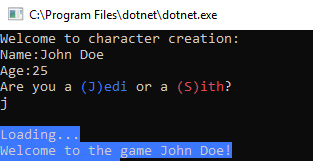

# FluentConsole
Build your Console Applications easily.

## Nuget
TODO

## Demo

Simple console application:



### Default Way 

```csharp
{
  var character = new Character();

  Console.WriteLine("Welcome to character creation:");
  Console.Write("Name:");
  character.Name = Console.ReadLine();
  
  Console.Write("Age:");

  while (true)
  {
      if (int.TryParse(Console.ReadLine(), out var age))
      {
          character.Age = age;
          break;
      }
      else
      {
          Console.WriteLine("Invalid number, please retry");
      }
  }

  while (true)
  {
      Console.Write("Are you a ");
      Console.ForegroundColor = ConsoleColor.Blue;
      Console.Write("(J)edi");
      Console.ResetColor();
      Console.Write(" Or a ");
      Console.ForegroundColor = ConsoleColor.Red;
      Console.Write("(S)ith");
      Console.ResetColor();
      Console.WriteLine("?");
      var key = Console.ReadKey().Key;

      if (key == ConsoleKey.J)
      {
          character.Alignment = Alignment.Jedi;
          break;
      }
      else if (key == ConsoleKey.S)
      {
          character.Alignment = Alignment.Sith;
          break;
      }
  }

  if (character.Alignment == Alignment.Jedi)
      Console.BackgroundColor = ConsoleColor.Blue;
  else
      Console.BackgroundColor = ConsoleColor.Red;

  Console.WriteLine();
  Console.WriteLine();

  bool _nowLoading = true;

  Task.Run(() =>
  {
      while (_nowLoading)
      {
          int cursorTop = (Console.CursorTop - 1) < 0 ? 0 : Console.CursorTop - 1;

          int currentLineCursor = Console.CursorTop;
          Console.SetCursorPosition(0, Console.CursorTop);

          for (int i = 0; i < Console.WindowWidth; i++)
              Console.Write(" ");

          Console.SetCursorPosition(0, currentLineCursor);

          Console.SetCursorPosition(0, cursorTop);
          Console.WriteLine("Loading.");
          Console.SetCursorPosition(0, cursorTop);
          Thread.Sleep(1000);
          Console.WriteLine("Loading..");
          Console.SetCursorPosition(0, cursorTop);
          Thread.Sleep(1000);
          Console.WriteLine("Loading...");
          Console.SetCursorPosition(0, cursorTop);
          Thread.Sleep(1000);
      }
  });

  DoComplexLogic();
  _nowLoading = false;
  Console.WriteLine($"Welcome to the game {character.Name}!");
}
```

### Fluent Way using FluentConsole

```csharp
{
    var character = new Character();

    FluentConsole
        .Initialize()
        .WriteLine("Welcome to character creation:")
        .Write("Name:")
        .ReadLine((name, _) => character.Name = name)
        .Write("Age:")
        .ReadLineAsInt((age, _) => character.Age = age, retryText: "Invalid number, please retry")
        .WriteLine("Are you a [color:Blue](J)edi[/color] or a [color:Red](S)ith[/color]?")
        .ReadKeyWithOptions()
            .If(ConsoleKey.J, (_, fluentConsole) =>
                {
                    character.Alignment = Alignment.Jedi;
                    fluentConsole.WithBackgroundColor(ConsoleColor.Blue);
                })
            .If(ConsoleKey.S, (_, fluentConsole) =>
                {
                    character.Alignment = Alignment.Sith;
                    fluentConsole.WithBackgroundColor(ConsoleColor.Red);
                })
            .ElseRetry(retryText: "Invalid option, please try again.")
        .DoWithLoading(() => DoComplexLogic(), loadingText: "Loading")
        .WriteLine($"Welcome to the game {character.Name}!");
}
```
